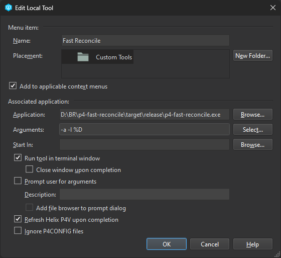

# p4-fast-reconcile

This program is a re-implementation for the frustratingly slow `Reconcile Offline Work` tool in P4V. It will download the depot state from the Helix Core server, scan your local workspace for files, compute and cache digests for files, compare both, then update the desired pending changelist. However, it is usually 10-100 times faster than using the original tool.

It was originally created for reconciling new versions of binary Unreal Engine builds at a previous workplace, but is now actively used and maintained at Brickadia.

## Performance Tests

Reconcile a small project (14k files, 50GB) with no changes
- `Reconcile Offline Work` done in 15 seconds
- `p4-fast-reconcile` without digest cache done in 4.5 seconds
- `p4-fast-reconcile` with digest cache done in 1 second

Reconcile a large Unreal Engine project (450k files, 250GB) with no changes
- `Reconcile Offline Work` done in 360 seconds
- `p4-fast-reconcile` without digest cache done in 55 seconds 
- `p4-fast-reconcile` with digest cache done in 14 seconds

Reconcile a version upgrade of a binary Unreal Engine build (older test, size unknown):
- `Reconcile Offline Work` canceled after ~2 hours
- `p4-fast-reconcile` without digest cache done in ~30 seconds

Performance of the `Reconcile Offline Work` tool appears to rapidly degrade with more changed files.  
This is not the case for p4-fast-reconcile, which is consistently faster and snappier to use.

## Usage

The program is ran as a custom tool from P4V. Set it up like this:

- Set Application to the location of the release executable.
- Set Arguments to `-l %D` for a dry run or `-a -l %D` for a real run.
- Check "Add to applicable context menus"
- Check "Run tool in terminal window"
- Check "Refresh Helix P4V upon completion"

Then right click a folder in your workspace and select the custom tool at the bottom.

## Features

It will correct the following types of inconsistency:

- Adding files in workspace, not in depot or deleted at have revision, but not checked out for add.
- Editing files in workspace, changed from have revision, but not checked out for edit.
- Revert+Editing files in workspace, changed from have revision, but checked out for delete.
- Deleting files not in workspace, but not checked out for delete.
- Revert+Deleting files not in workspace, but checked out for edit.
- Reverting files not in workspace, but checked out for add.
- Reverting files in workspace, not changed from have revision, but checked out for edit.
- Reverting files in workspace, not changed from have revision, but checked out for delete.

This is equivalent to running "Reconcile Offline Work" followed by "Revert Unchanged".

## Known Issues

It has only been tested on our repositories, so it may not work for you if you use configuration different from ours.  
Use the dry run mode first to see whether it is working as intended. You are responsible for changes made to your repository.

- The `apple` digest type on depot files is not supported. This is not normally used.
- `p4-fast-reconcile` does not implement move/add/delete pair detection.
